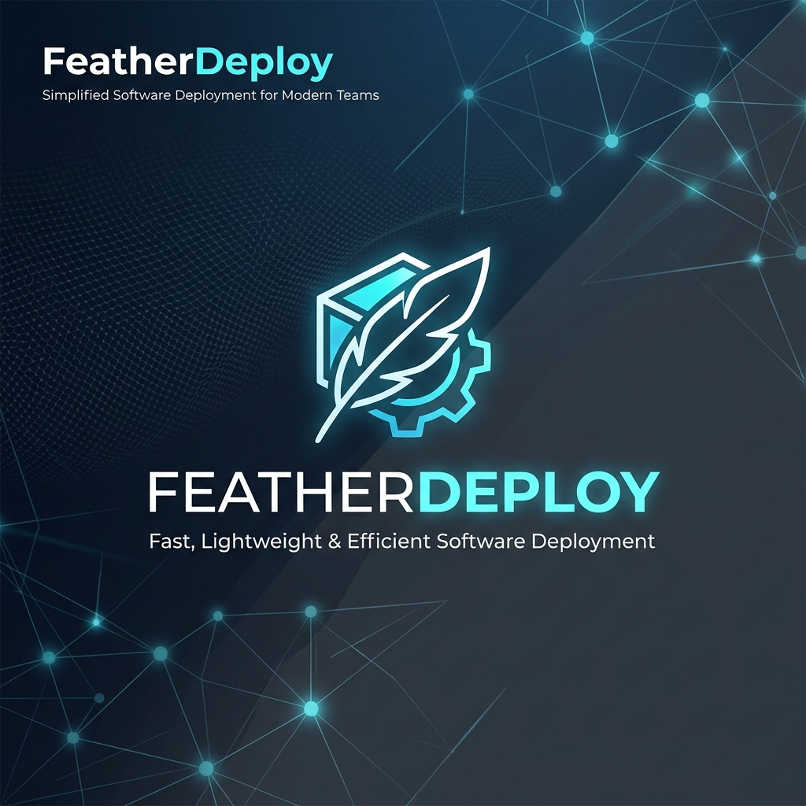
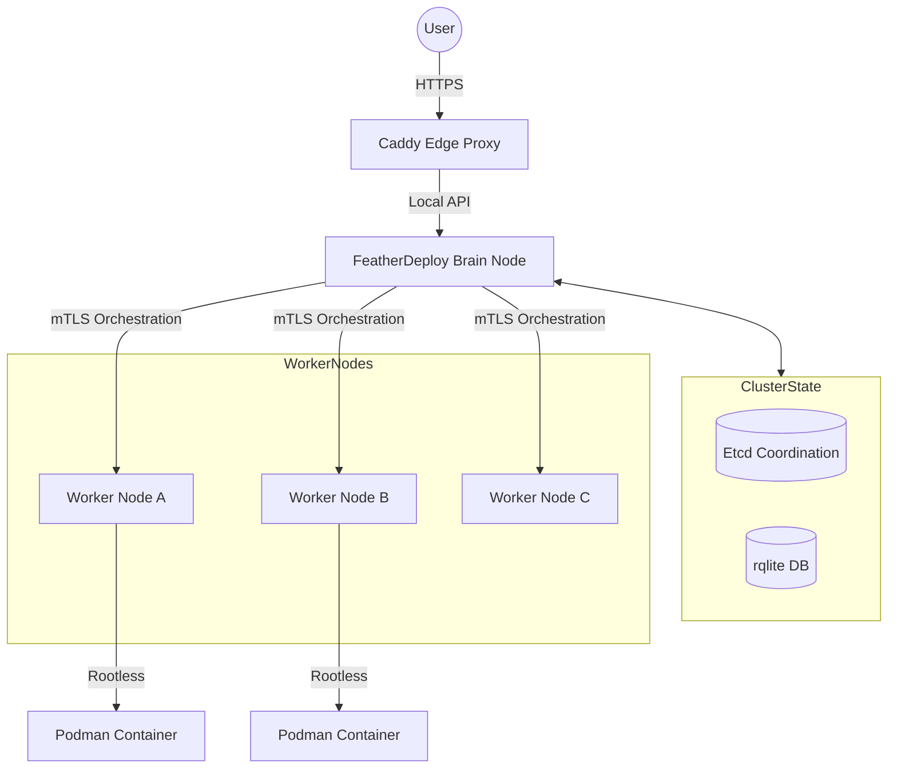

<div align="center">



# 🪶 FeatherDeploy

**A high-performance, self-hosted PaaS panel for orchestrating containerised applications across multi-node clusters.**

[](LICENSE)
[](https://go.dev)
[](https://react.dev)
[](https://tailwindcss.com)
[](https://vitejs.dev)

</div>

---

## ✨ Features

FeatherDeploy is designed to bridge the gap between simple single-server setups and complex Kubernetes clusters. It provides a lightweight, secure, and user-friendly interface for managing your deployments.

- **🚀 Multi-Node Orchestration** — Deploy applications across multiple worker nodes with intelligent scheduling and resource telemetry.
- **⚡ Single Binary Execution** — The React 19 frontend is embedded directly into the Go binary. Deployment is as simple as running one file.
- **🛡️ Rootless Security** — Built on Podman, all containers run in rootless mode using user namespaces. The panel itself runs as a non-root service user.
- **🔒 Distributed Coordination** — Utilizes **Etcd** for cluster state management and **rqlite** for distributed data consistency.
- **🌐 Automatic TLS & Proxy** — Integrated Caddy server handles automatic HTTPS via Let's Encrypt and zero-config reverse proxying.
- **📂 GitHub Integration** — Native support for OAuth, GitHub Apps, and SSH key management for seamless "Push to Deploy" workflows.
- **🤖 Framework Detection** — Automatically detects languages and frameworks (Node.js, Go, Python, etc.) to generate optimized Dockerfiles.
- **✉️ Enterprise RBAC** — Granular permissions with global roles and project-specific access controls.

---

## 🖥️ Tech Stack

| Layer | Technology |
| :--- | :--- |
| **Frontend** | React 19, TypeScript, Vite 8, Tailwind CSS v4, shadcn/ui, TanStack Query v5 |
| **Backend** | Go 1.26, Chi v5 Router, Etcd v3 (Coordination), rqlite (Distributed Storage) |
| **Containerization** | Podman (Rootless OCI), Buildah (Image Building) |
| **Networking** | Caddy 2 (Auto-TLS), mTLS for internal node communication |
| **Auth** | JWT (HS256/RS256), bcrypt (Cost 14), AES-256-GCM for sensitive data |
| **Infrastructure** | systemd (Service management), Linux User Namespaces |

---

## 🏗️ Architecture



---

## 🚀 Quick Installation (Linux)

> **Requirements:** Ubuntu 22.04+, Debian 12+, or Fedora. Requires a public IP and a domain name pointing to it.

```bash
curl -fsSL https://raw.githubusercontent.com/ojhapranjal26/FeatherDeploy/main/build.sh | sudo bash
```

The installer will:
1. Install system dependencies (Go, Node.js, Podman, Caddy).
2. Build the project from source and install the binary to `/usr/local/bin`.
3. Guide you through an interactive setup for the Superadmin and Cluster configuration.

---

## 📋 Post-Installation

### Manage Services
```bash
sudo systemctl status featherdeploy    # Panel & Brain
sudo systemctl status featherdeploy-node # Worker (if applicable)
sudo systemctl status caddy            # Proxy
```

### View Live Logs
```bash
sudo journalctl -u featherdeploy -f
```

### Configuration
Environment variables are stored in `/etc/featherdeploy/featherdeploy.env`. Use `sudo` to edit and restart the service to apply changes.

---

## 🔒 Security First

FeatherDeploy is built with a **Defense in Depth** strategy:
- **No Root Required**: Neither the panel nor the containers run as root.
- **Encrypted Secrets**: All SSH private keys and GitHub tokens are stored with AES-256-GCM encryption.
- **Internal mTLS**: Communication between the Brain and Worker nodes is secured via mutual TLS with an internal CA.
- **Isolated Namespaces**: Rootless Podman ensures that even a container escape remains confined to a non-privileged user namespace.

---

## 🛠️ Development

### Setup
```bash
git clone https://github.com/ojhapranjal26/FeatherDeploy.git
cd FeatherDeploy
```

### Backend
```bash
cd backend
cp .env.example .env
go run ./cmd/server/
```

### Frontend
```bash
cd frontend
npm install
npm run dev
```

The dev server proxies API requests to `localhost:8080` by default.

---

## 📁 Project Structure

```text
.
├── backend/
│   ├── cmd/            # Entry points (server/node)
│   ├── internal/       # Core logic (deploy, auth, coordination, pki)
│   ├── migrations/     # Database schema migrations
│   └── web/            # Embedded frontend assets
├── frontend/
│   ├── src/            # React components and pages
│   └── public/         # Static assets
├── docs/               # Detailed guides (GitHub Setup, Cluster setup)
└── build.sh            # Universal Linux installation script
```

---

## 🤝 Contributing & License

Contributions are what make the open-source community such an amazing place to learn, inspire, and create. Any contributions you make are **greatly appreciated**.

Distributed under the MIT License. See `LICENSE` for more information.

---
<div align="center">
Built with ❤️ by the FeatherDeploy Team
</div>
